# Microsoft Sentinel SOC Lab — Azure VM Build, Detection Engineering & Incident Response

## Project Overview

This project documents the **full build-to-investigation lifecycle** of a Microsoft Sentinel SOC lab. I created the Azure infrastructure, deployed a Windows Server 2022 virtual machine, onboarded Windows Security Events into Microsoft Sentinel with Azure Monitor Agent (AMA), wrote KQL detection logic, created a scheduled analytics rule mapped to MITRE ATT&CK, generated authentication telemetry, investigated the resulting incident, enriched entities, correlated failed and successful logons, and closed the incident with an analyst classification.

> **Public-repository note:** screenshots have been sanitized. Public IP addresses, subscription identifiers, and account/profile information are redacted where appropriate.

## What I Built

```text
Azure Resource Group
        |
        +-- Windows Server 2022 VM (SOC-Windows-01)
        |       |
        |       +-- Windows Security Event Log
        |       +-- RDP test traffic
        |
        +-- Log Analytics Workspace (SOC-Sentinel-LAW)
                |
                +-- Microsoft Sentinel
                +-- Windows Security Events via AMA
                +-- Data Collection Rule
                +-- KQL analytics
                +-- Scheduled detection rule
                +-- Alerts / Incidents / Entities
```

## Technologies & Skills

- Microsoft Azure
- Windows Server 2022
- Azure Virtual Machines
- Network Security Groups / RDP
- Log Analytics Workspace
- Microsoft Sentinel
- Azure Monitor Agent (AMA)
- Data Collection Rules (DCR)
- Windows Security Event Logs
- Kusto Query Language (KQL)
- Microsoft Defender portal
- MITRE ATT&CK T1110 — Brute Force
- Entity mapping
- Threat-intelligence enrichment
- Incident triage, correlation, classification, and resolution

---

# Phase 1 — Build the Azure SOC Endpoint

## 1. Create the Windows Server VM

I created an Azure Windows Server 2022 Datacenter VM in the `SOC-Lab-RG` resource group and named the endpoint `SOC-Windows-01`.

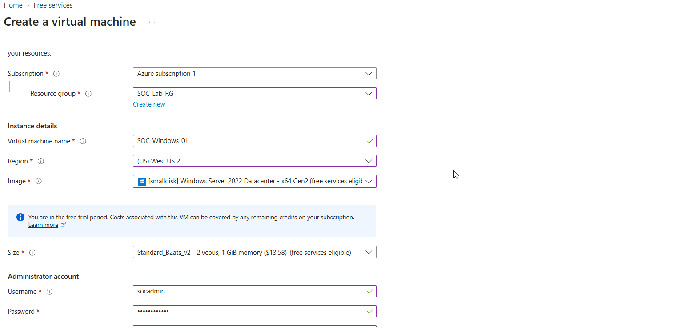

The VM was deployed with the supporting Azure networking resources required for the lab, including a virtual network, network security group, and public IP resource.

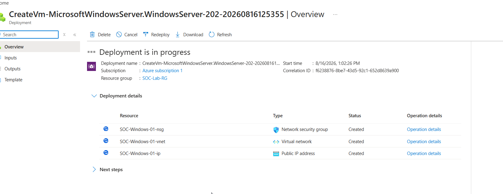

After deployment, I verified the Windows Server VM was running and ready for management.

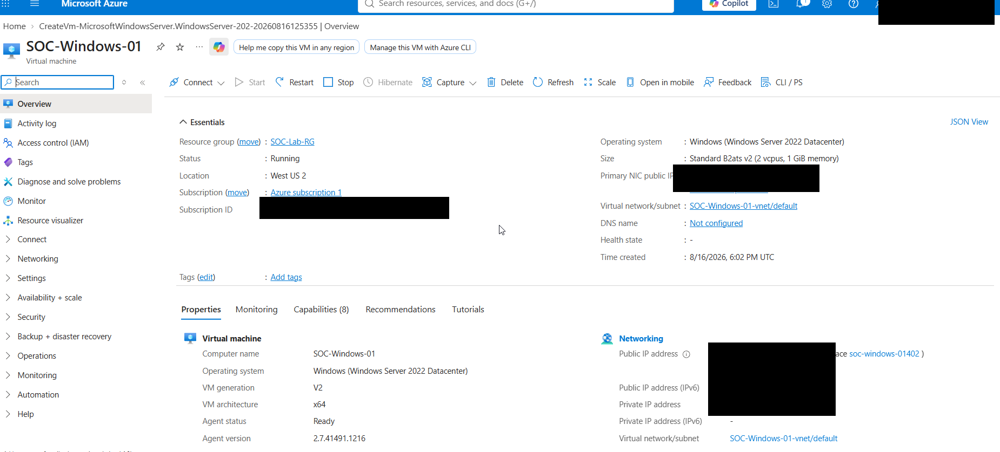

### Security note

RDP was required to generate authentication telemetry for this controlled lab. In a production environment, administrative access should be tightly restricted with controls such as source-IP restrictions, Azure Bastion, JIT VM access, VPN/private connectivity, MFA where applicable, and least-privilege administration.

---

# Phase 2 — Deploy Log Analytics & Microsoft Sentinel

## 2. Create the Log Analytics Workspace

I created the `SOC-Sentinel-LAW` Log Analytics workspace to provide centralized storage and querying for security telemetry.

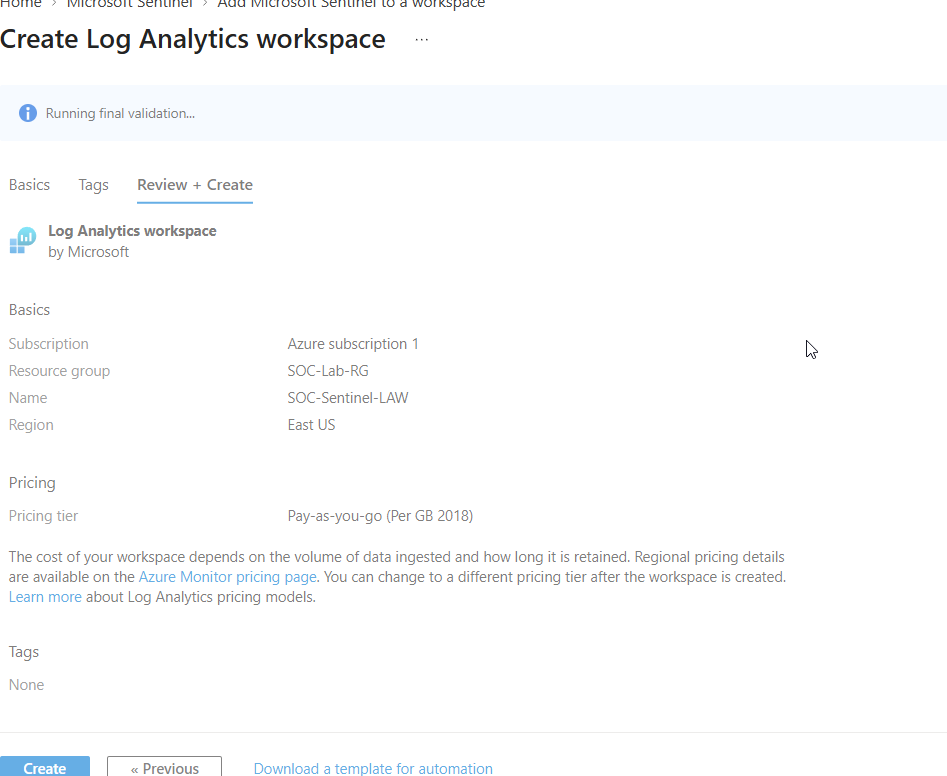

## 3. Install the Windows Security Events Solution

Inside Microsoft Sentinel Content Hub, I located the **Windows Security Events** solution.

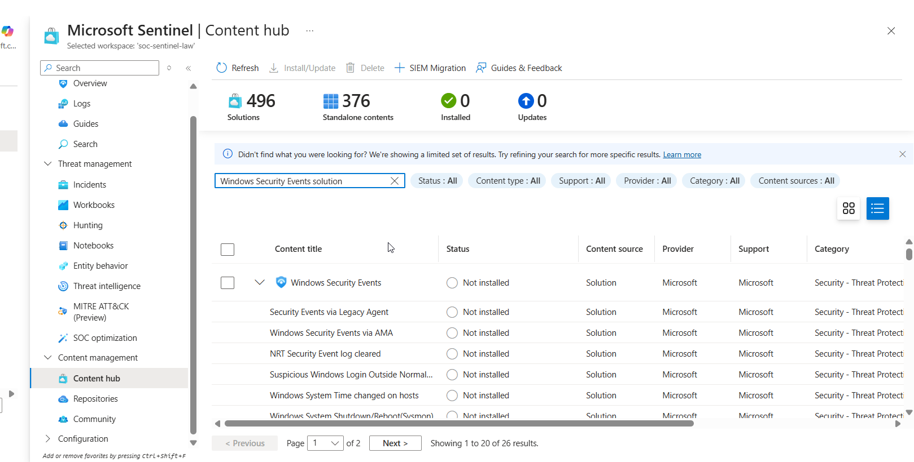

After installation, the solution exposed the **Windows Security Events via AMA** connector and supporting Sentinel content.

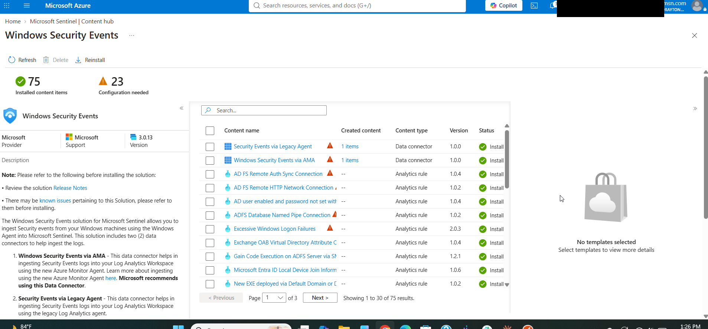

## 4. Configure Windows Security Events via AMA

I opened the Windows Security Events via AMA connector and created a Data Collection Rule.

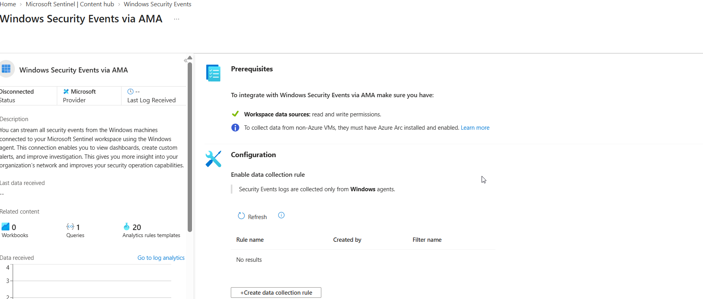

The DCR targeted `SOC-Windows-01`, allowing the Azure Monitor Agent to collect Windows Security Event telemetry from the VM.

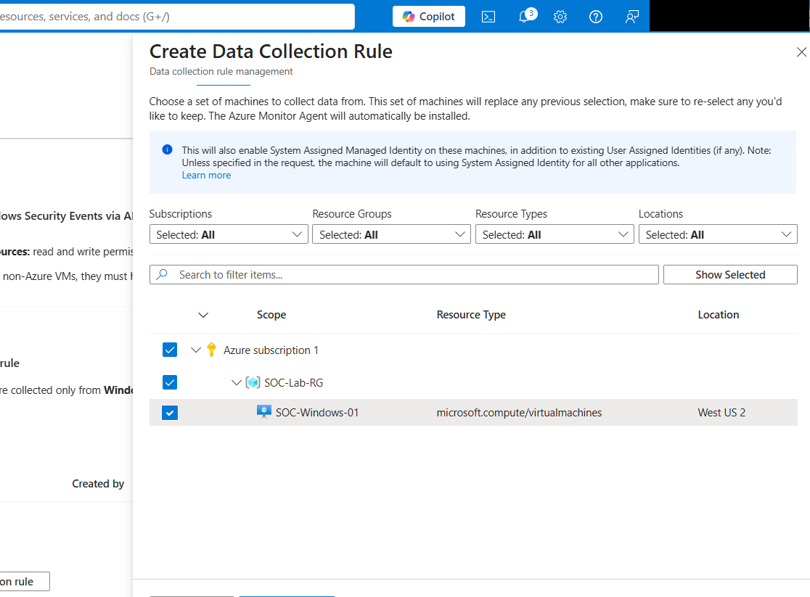

The rule was configured to collect Security Events and passed Azure validation.

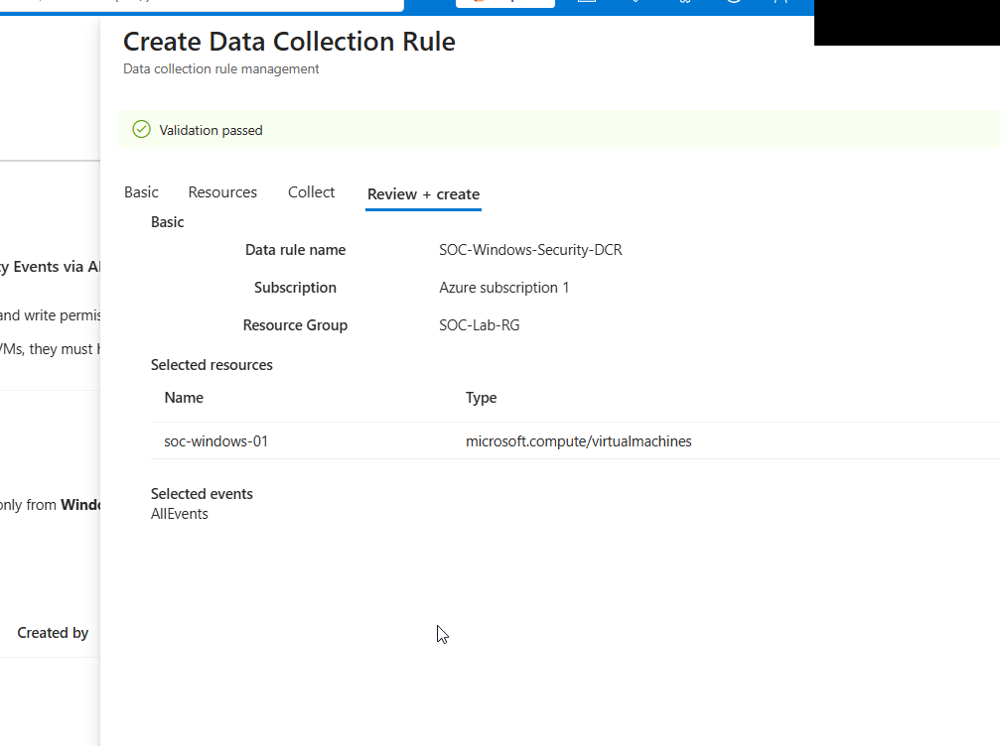

---

# Phase 3 — Validate Telemetry & Engineer the Detection

## 5. Validate SecurityEvent Ingestion

After onboarding the VM, I confirmed Windows Security events were arriving in the Sentinel Log Analytics workspace.

```kusto
SecurityEvent
| take 20
```

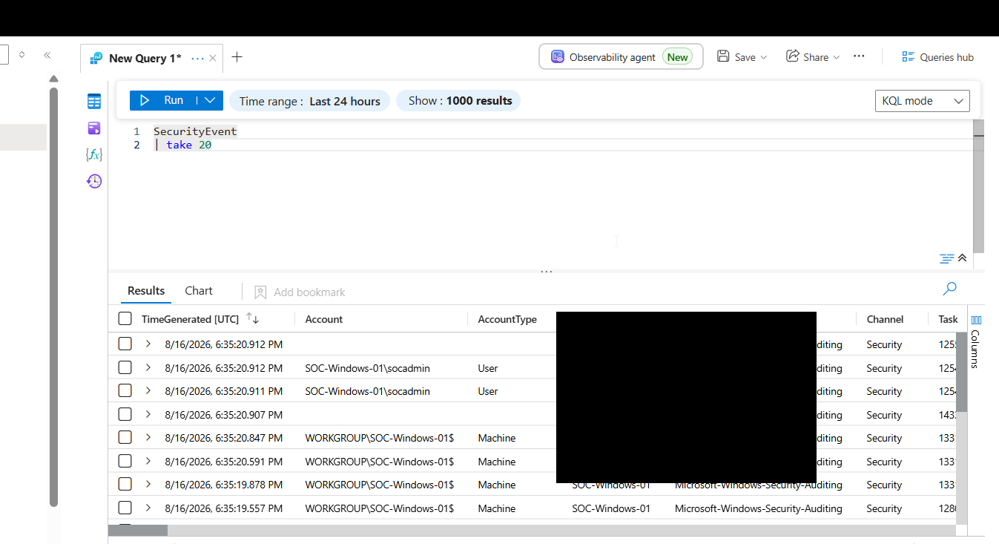

## 6. Identify Failed Authentication Events

Windows Event ID **4625** represents a failed logon. I queried recent failed authentication events and reviewed the account, host, source IP, and logon type.

```kusto
SecurityEvent
| where TimeGenerated > ago(10m)
| where EventID == 4625
| where LogonType in (3, 10)
| project TimeGenerated, Computer, Account, IpAddress, LogonType
| sort by TimeGenerated desc
```

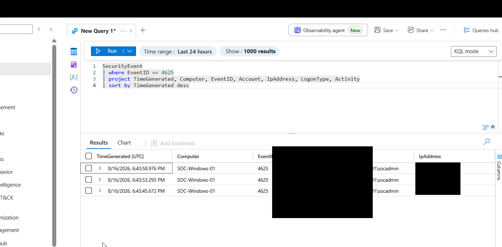

### Detection-engineering lesson

The first version of the rule filtered only for `LogonType == 10`, expecting RemoteInteractive authentication. The actual test telemetry showed the relevant failed attempts as **LogonType 3**. I adjusted the detection to include both types instead of relying on an assumption.

## 7. Build the Brute-Force Detection

```kusto
SecurityEvent
| where EventID == 4625
| where LogonType in (3, 10)
| summarize
    FailedAttempts = count(),
    FirstAttempt = min(TimeGenerated),
    LastAttempt = max(TimeGenerated)
    by IpAddress, Account, Computer, LogonType
| where FailedAttempts >= 3
```

I converted this query into a scheduled Sentinel analytics rule.

**Rule configuration**

| Setting | Value |
|---|---|
| Rule | Multiple Failed RDP Login Attempts |
| Severity | Medium |
| MITRE ATT&CK tactic | Credential Access |
| Technique | T1110 — Brute Force |
| Frequency | 5 minutes |
| Detection threshold | 3+ failed attempts |
| Incident creation | Enabled |

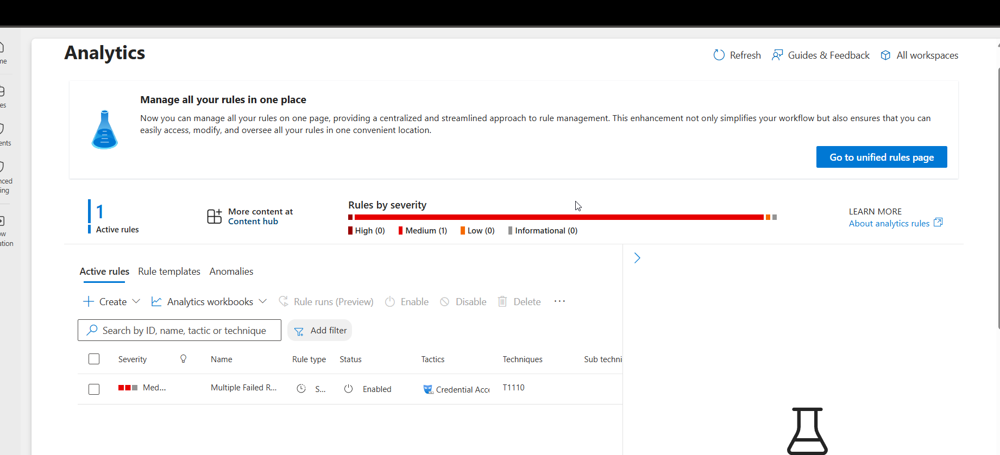

## 8. Generate and Validate the Incident

After generating controlled failed authentication attempts, Sentinel created the expected incident.

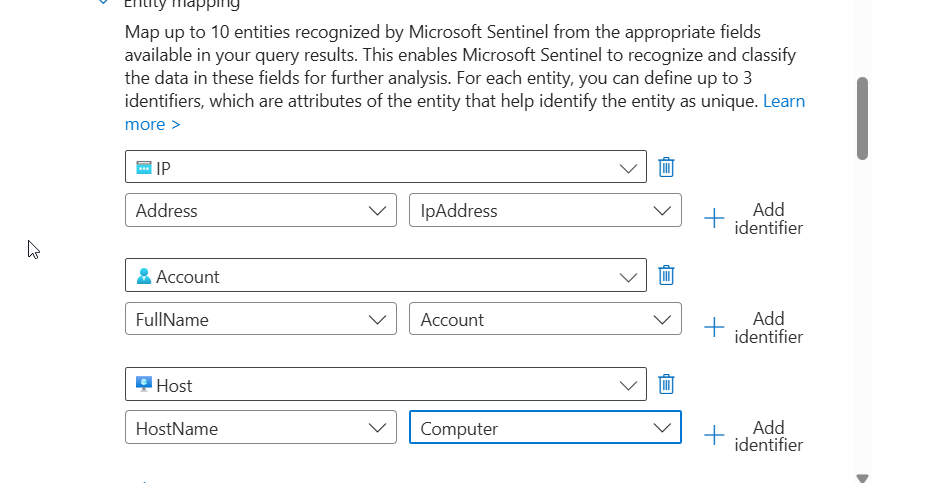

---

# Phase 4 — Improve Context with Entity Mapping

I mapped the detection output to native Sentinel entities:

| Sentinel Entity | Identifier | KQL Field |
|---|---|---|
| IP | Address | `IpAddress` |
| Account | FullName | `Account` |
| Host | HostName | `Computer` |

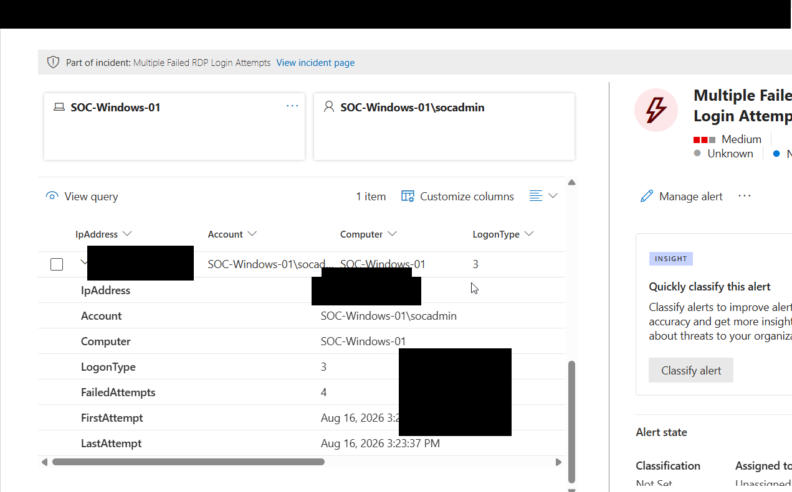

This allowed subsequent incidents to display the host, account, and source-IP relationships directly in the investigation graph.

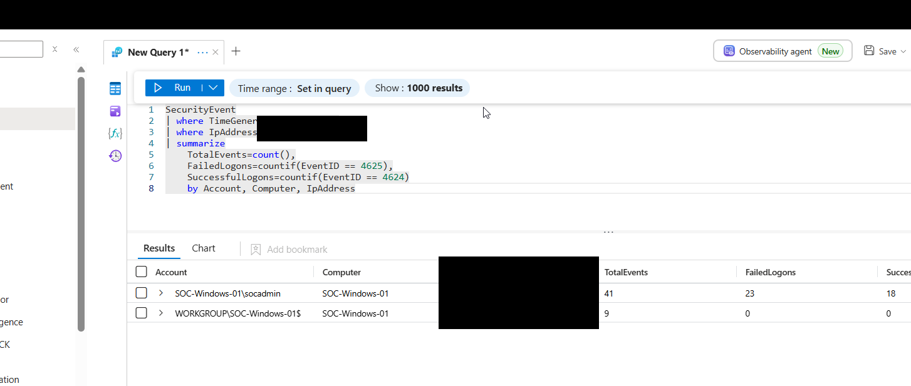

---

# Phase 5 — Investigate the Alert

## 9. Correlate Failed and Successful Authentication

I investigated both:

- **4625** — failed logon
- **4624** — successful logon

I correlated events using the account, host, source IP, time, and logon type.

```kusto
SecurityEvent
| where TimeGenerated > ago(24h)
| summarize
    TotalEvents = count(),
    FailedLogons = countif(EventID == 4625),
    SuccessfulLogons = countif(EventID == 4624)
    by Account, Computer, IpAddress
```


The investigation also included reviewing authentication packages and logon processes, Sentinel/Defender entity context, threat-intelligence reputation, and Advanced Hunting for additional activity.

---

# Phase 6 — Analyst Determination & Resolution

The rule correctly detected the suspicious authentication pattern. However, the behavior was intentionally generated as part of this authorized SOC lab.

The incident was therefore resolved as:

**Informational, expected activity → Security testing**

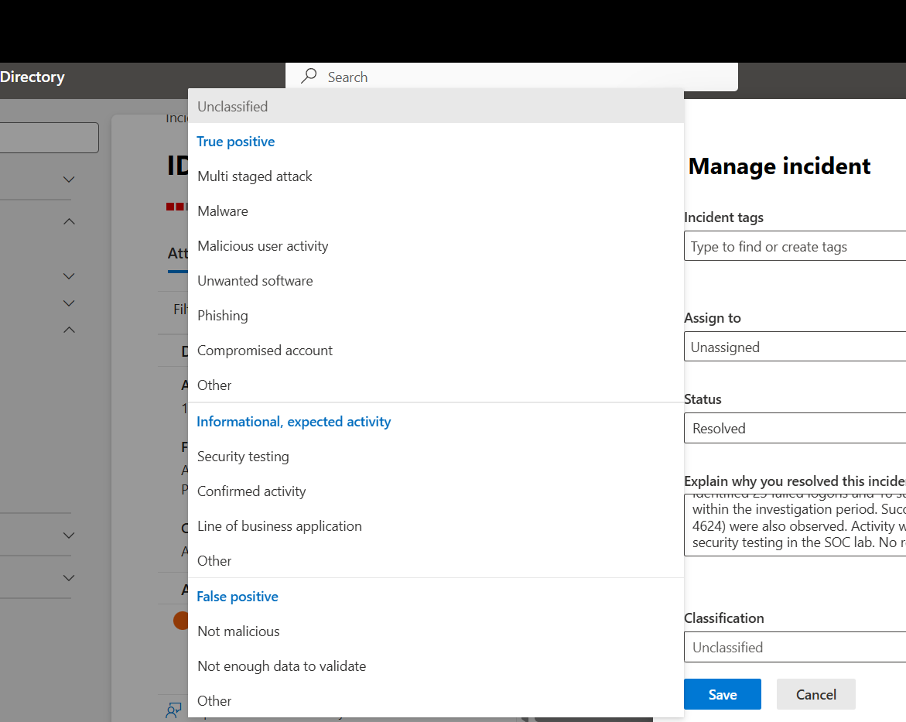

## Incident Lifecycle Completed

```text
Azure Infrastructure
        ↓
Windows Security Telemetry
        ↓
Azure Monitor Agent / DCR
        ↓
Log Analytics
        ↓
Microsoft Sentinel
        ↓
KQL Detection
        ↓
Scheduled Analytics Rule
        ↓
Alert
        ↓
Incident
        ↓
Entity Enrichment
        ↓
Investigation & Correlation
        ↓
Classification / Resolution
```

---

# Key Takeaways

1. Built the Azure infrastructure rather than working only with preconfigured Sentinel data.
2. Configured AMA/DCR-based Windows Security Event ingestion.
3. Developed and troubleshot custom KQL detection logic.
4. Mapped the detection to MITRE ATT&CK **T1110**.
5. Improved incident context through IP, account, and host entity mapping.
6. Correlated Windows **4625** failures with **4624** successful authentications.
7. Used threat intelligence and hunting pivots during triage.
8. Completed the full SOC workflow from infrastructure deployment through incident resolution.

## Repository Structure

```text
microsoft-sentinel-soc-lab/
├── README.md
├── SECURITY-NOTE.md
├── .gitignore
├── screenshots/
│   ├── 01-build/
│   ├── 02-onboard/
│   ├── 03-detect/
│   └── 04-investigate/
├── kql/
│   ├── failed-logons.kql
│   ├── brute-force-detection.kql
│   ├── authentication-timeline.kql
│   ├── authentication-summary.kql
│   └── successful-logon-details.kql
└── incident-report/
    └── failed-rdp-investigation.md
```

## Resume / Portfolio Bullet

> Built an end-to-end Microsoft Sentinel SOC lab in Azure by deploying a Windows Server 2022 VM, configuring Azure Monitor Agent and Data Collection Rules for Windows Security Event ingestion, developing KQL brute-force detections mapped to MITRE ATT&CK T1110, and performing incident enrichment, authentication-event correlation, threat hunting, classification, and resolution.
